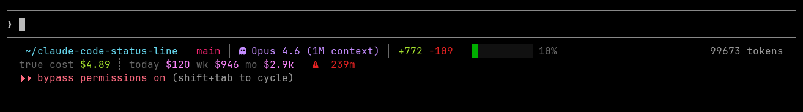

# Claude Code Status Line

A two-line status bar for [Claude Code](https://claude.ai/code) that shows real-time API costs, session context, and aggregate spend at a glance.

Even on a Max x20 subscription where you never see a bill per token, seeing the true API cost of every session is eye-opening. This status line was built to make that invisible spend visible — so you understand what these things actually cost.



## Features

- **Two-line layout** — session info on top, cost tracking below
- **Real-time session cost** — color-coded by spend (green/yellow/red)
- **Aggregate spend** — today, this week, and this month at API rates
- **Context window bar** — gradient fill shows how much context you've used
- **Long session warnings** — duration appears at 60+ min with escalating colors
- **Accurate pricing** — uses current Opus 4.6 / Sonnet 4.6 / Haiku 4.5 rates
- **Session start bucketing** — costs attributed to the day the session began, not when the file was last modified
- **One-command install** — works with systemd timers or cron

## Line 1 — Session

| Segment | Example | Description |
|---------|---------|-------------|
| Directory | `~/project` | Shortened working directory |
| Git branch | `main` | Current branch or short SHA |
| Model | `Opus 4.6 (1M context)` | Active Claude model |
| Diff | `+772 -109` | Lines added/removed this session |
| Vim mode | `[N]` | Normal or Insert (if vim mode enabled) |
| Session name | `"refactor"` | Named session (if set) |
| Context bar | `██░░ 10%` | Context window usage (green < 50%, orange < 75%, red 75%+) |

## Line 2 — Costs

| Segment | Example | Description |
|---------|---------|-------------|
| True cost | `$4.89` | This session at API rates. Green < $5, yellow < $15, red $15+ |
| Today | `$120` | Calendar day total |
| Week | `$946` | Rolling 7 days |
| Month | `$2.9k` | Rolling 30 days. Values over $999 display as `$X.Xk` |
| Duration | `3h59m` | Only shown at 60+ min. Yellow 1h+, red 2h+, red + warning 3h+ |

## Install

```bash
git clone https://github.com/lperez37/claude-code-status-line.git
cd claude-code-status-line
bash install.sh
```

The installer:
1. Copies `statusline.sh` and `cost-tracker.sh` to `~/.claude/`
2. Adds the `statusLine` entry to `~/.claude/settings.json`
3. Sets up a systemd user timer (or cron job) to refresh costs every 15 minutes
4. Builds the initial cost cache

Restart Claude Code after installation.

## Uninstall

```bash
bash uninstall.sh
```

## Requirements

- [Claude Code](https://claude.ai/code) installed (`~/.claude/` directory)
- `jq`
- `git`
- Linux with `systemd` (preferred) or `crontab`
- A [Nerd Font](https://www.nerdfonts.com/) for icons (optional but recommended)

## How it works

**`statusline.sh`** receives a JSON blob from Claude Code on every render. It parses session data (model, cost, context usage, lines changed) and reads aggregate costs from a local cache file.

**`cost-tracker.sh`** runs every 15 minutes via systemd timer or cron. It scans all JSONL session transcripts in `~/.claude/projects/`, extracts token usage, and calculates costs using current Anthropic API pricing:

| Model | Input | Output | Cache Read | Cache Write |
|-------|-------|--------|------------|-------------|
| Opus 4.5+ | $5/1M | $25/1M | $0.50/1M | $6.25/1M |
| Sonnet 4.6 | $3/1M | $15/1M | $0.30/1M | $3.75/1M |
| Haiku 4.5 | $1/1M | $5/1M | $0.10/1M | $1.25/1M |

Results are cached in `~/.claude/cost-cache.json`. You can also refresh manually:

```bash
bash ~/.claude/cost-tracker.sh
```

## Customization

**Cost color thresholds** — edit `cost_colour` in `statusline.sh`:
- Green: < $5 | Yellow: < $15 | Red: $15+

**Duration thresholds** — in `statusline.sh`:
- 1h+: yellow | 2h+: red | 3h+: red + warning

**Refresh interval** — edit `OnUnitActiveSec` in `systemd/claude-cost-tracker.timer` (default 15 min)

**Pricing** — update the rates in `cost-tracker.sh` if Anthropic changes their API pricing

**Separators** — line 1 uses `│`, line 2 uses `┊`. Change `sep1`/`sep2` in the render section to any Unicode character you like:
```
│  ┊  ¦  ·  •  ◆  ›  »  ❯  ▸    
```

## License

MIT
